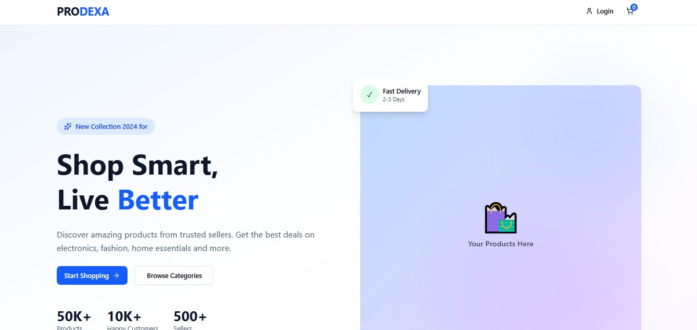

Next-Gen AI E-Commerce Platform Conversational Shopping, Architected for Scale.
  
A modern e-commerce solution that replaces traditional search filters with an intelligent, autonomous AI agent. Built on a resilient microservices architecture, it bridges the gap between natural language intent and digital checkout.

   
  
   
   
  

    
    
    
    

  

    
    
    
  

   
  View Live Demo · Report Bug · Request Feature

   
   
  

   
   
  ✨ The AI AdvantageThis isn't just a chatbot tacked onto a store. We integrated LangChain and LangGraph deeply into the backend logic to create an agent that takes meaningful action.User: "I need an outfit for a summer outdoor wedding, budget is around $150."AI Agent: Understands context, filters catalog by style/season/price, selects complementary items, and automatically adds them to the cart.
   
   
  🏗️ System ArchitectureWe moved beyond the monolith to ensure maintainability and resilience. The backend is split into decoupled microservices handling distinct domains:Auth Service (Role-based identity management)Product Catalog (Inventory and Search)Cart/Order Management (Transactional flows)AI Orchestration (LangGraph Logic)
   
   
  
  🎯 Key Features: 
   
   
  🤖 AI Shopping AssistantNatural Language Processing driven by LLMs to discover products and perform autonomous cart actions.
   
   
  🛒 Microservices BackendHighly decoupled services ensuring system resilience; failure in one module does not halt the entire platform.
   
   
  📈 Real-Time Seller DashComprehensive portal for merchants to manage inventory live and view instant sales analytics.
   
   
  🔐 Role-Based SecurityRobust JWT authentication securing endpoints for distinct access levels (Customer, Seller, Admin).
   
   
 
 

⚡ Live Deployment Experience the platform live. The frontend is hosted on Vercel and the backend services are orchestrated on Render.
🔗 

<a href="https://prodexa-tau.vercel.app/">
Visit Prodexa Live
</a>

 
 
 

Built with ❤️ by Fayd

